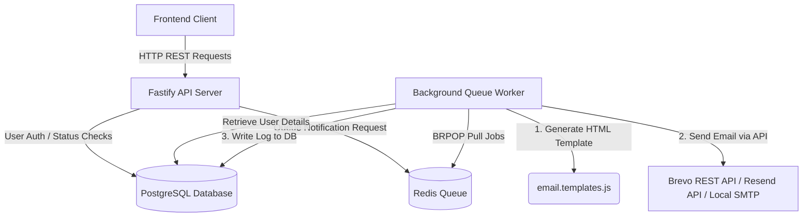

# ⚡ NotiFlow — Auth & Notification Engine (Developer & Frontend AI Handoff Guide)

Welcome to **NotiFlow**, a high-performance, production-grade backend REST API built from scratch with **Node.js + Fastify**. It features a custom authentication system (JWT access/refresh tokens) and an asynchronous background notification queue processor.

This document serves as a complete blueprint of the backend architecture, the scope of work completed, and a guide for a **Frontend Developer or Frontend AI Agent** to build a user interface for this service.

---

## 📖 Table of Contents
1. [🚀 Project Overview](#-project-overview)
2. [🎯 Scope of Backend Work Completed](#-scope-of-backend-work-completed)
3. [📧 The Hybrid Email Delivery Architecture](#-the-hybrid-email-delivery-architecture)
4. [🛠️ Tech Stack](#️-tech-stack)
5. [🔌 API Integration Guide (For Frontend AIs)](#-api-integration-guide-for-frontend-ais)
   - [Authentication Flow](#authentication-flow)
   - [Notification Trigger Flow](#notification-trigger-flow)
6. [📋 API Endpoints Reference](#-api-endpoints-reference)

---

## 🚀 Project Overview

NotiFlow is designed to be an authentication and notification gateway. It manages user accounts, handles secure sessions, and queues notifications (Email, Webhooks, Push) to be processed asynchronously without blocking the main thread.



---

## 🎯 Scope of Backend Work Completed

During our pair-programming session, we solved a major deployment blocker: **Render's Free Tier blocks outbound SMTP traffic (ports 25, 465, 587)**, preventing traditional email delivery using Nodemailer.

We successfully implemented the following solutions:
1. **Dynamic Hybrid Mailer ([src/config/mailer.js](file:///D:/SwitchJob/notiflow/src/config/mailer.js)):**
   - Built a custom mailer that automatically selects the email delivery system based on environment variables.
   - **Brevo API (Production Default):** Uses Brevo’s HTTP REST API (port 443) which works completely free, allows sending emails to anyone, and requires *no custom domain* (just a verified personal Gmail address).
   - **Resend API (Optional Production):** Uses the Resend Node.js SDK over HTTP, ideal if you have a verified custom domain.
   - **SMTP Fallback (Local Development):** Automatically falls back to standard Nodemailer SMTP using Gmail App Passwords locally where SMTP ports are not blocked.
2. **Premium Dark Email Templates ([src/config/email.templates.js](file:///D:/SwitchJob/notiflow/src/config/email.templates.js)):**
   - Redesigned the email layouts to look extremely premium (similar to Vercel/Linear).
   - Features modern typography (`Plus Jakarta Sans`), a sleek glowing top-accent gradient, pill badges, and structured details cards.
   - Works seamlessly with all three email providers.
3. **Advanced CLI Console Boot UI ([src/app.js](file:///D:/SwitchJob/notiflow/src/app.js)):**
   - Configured a beautiful CLI startup card showing active services, connection status, the active email provider, and clickable endpoint routes.

---

## 📧 The Hybrid Email Delivery Architecture

The system checks three environment variables to decide how to route emails:

| Provider | Trigger Variable | Protocol/Port | Best Used For | Domain Requirement |
|---|---|---|---|---|
| **Brevo API** | `BREVO_API_KEY` | HTTPS (443) | Production (Render free tier) | **None** (Send from verified personal Gmail) |
| **Resend API** | `RESEND_API_KEY` | HTTPS (443) | Production (Render/Resend) | **Required** (To send to anyone) |
| **SMTP Fallback**| None (empty keys) | SMTP (587/465) | Local Development | **None** (Gmail App Password) |

---

## 🛠️ Tech Stack

*   **Runtime:** Node.js (v18+)
*   **Web Framework:** Fastify (lightweight, high throughput)
*   **Database:** PostgreSQL (Neon Serverless)
*   **In-Memory Store / Queue:** Redis (Upstash Serverless)
*   **Email Engine:** Brevo API / Resend API / Nodemailer (SMTP)
*   **Security:** JWT (Access + Refresh tokens), BCrypt password hashing

---

## 🔌 API Integration Guide (For Frontend AIs)

If you are a Frontend AI model or developer building a client app (React, Next.js, Vue, mobile app), here is how to communicate with NotiFlow:

### Authentication Flow
NotiFlow uses **Double-Token JWT Auth** for maximum security.

1. **Register/Login:**
   - Client sends credentials (`email`, `password`) to `/api/auth/login`.
   - Server responds with:
     *   An **Access Token** (short-lived, 15m) in the JSON body.
     *   A **Refresh Token** (long-lived, 7d) in a secure, HTTP-only cookie.
2. **Authorized Requests:**
   - For any protected route, the client must add the header:
     `Authorization: Bearer <access_token>`
3. **Token Expiry & Silent Refresh:**
   - If a request returns `401 Unauthorized` (expired access token), the client must POST to `/api/auth/refresh`.
   - The server reads the HTTP-only cookie, validates it, and returns a fresh **Access Token**.

### Notification Trigger Flow
Notifications are processed asynchronously.
1. Frontend makes a request to trigger a notification (e.g. creating a notification or during user registration).
2. The controller pushes the request details (job payload) into the **Redis Queue** (`notiflow:queue`).
3. The server immediately returns a `202 Accepted` response.
4. The background queue worker pops the job, gets the user's details, renders the premium HTML template, sends it via the active email provider, and logs the result to the database.

---

## 📋 API Endpoints Reference

All request bodies must be JSON.

### 🔑 Authentication (`/api/auth`)

#### 1. Register User
*   **POST** `/register`
*   **Request Body:**
    ```json
    {
      "name": "John Doe",
      "email": "john.doe@example.com",
      "password": "SecurePassword123"
    }
    ```
*   **Success Response (`201 Created`):**
    ```json
    {
      "success": true,
      "message": "User registered successfully",
      "data": {
        "id": 1,
        "name": "John Doe",
        "email": "john.doe@example.com"
      }
    }
    ```

#### 2. User Login
*   **POST** `/login`
*   **Request Body:**
    ```json
    {
      "email": "john.doe@example.com",
      "password": "SecurePassword123"
    }
    ```
*   **Success Response (`200 OK`):**
    *   *Set-Cookie Headers: `refresh_token=...; HttpOnly; Secure; SameSite=Strict`*
    ```json
    {
      "success": true,
      "message": "Logged in successfully",
      "data": {
        "accessToken": "eyJhbGciOi...",
        "user": {
          "id": 1,
          "name": "John Doe",
          "email": "john.doe@example.com"
        }
      }
    }
    ```

#### 3. Refresh Access Token
*   **POST** `/refresh`
*   **Request Headers:** *Requires `refresh_token` cookie*
*   **Success Response (`200 OK`):**
    ```json
    {
      "success": true,
      "accessToken": "new_eyJhbGciOi..."
    }
    ```

#### 4. Change Password
*   **POST** `/change-password`
*   **Request Headers:** `Authorization: Bearer <access_token>`
*   **Request Body:**
    ```json
    {
      "currentPassword": "SecurePassword123",
      "newPassword": "NewSecurePassword456"
    }
    ```
*   **Success Response (`200 OK`):**
    ```json
    {
      "success": true,
      "message": "Password changed successfully"
    }
    ```

#### 5. User Logout
*   **POST** `/logout`
*   **Request Headers:** `Authorization: Bearer <access_token>`
*   **Success Response (`200 OK`):**
    *   *Clears the `refresh_token` cookie*
    ```json
    {
      "success": true,
      "message": "Logged out successfully"
    }
    ```

---

### 🔔 Notifications (`/api/notifications`)

#### 1. Trigger Notification (Send Notification)
*   **POST** `/send`
*   **Request Headers:** `Authorization: Bearer <access_token>`
*   **Request Body:**
    ```json
    {
      "userId": 1,
      "type": "WELCOME", 
      "title": "Welcome to NotiFlow! 🎉",
      "message": "Start building your notification pipelines."
    }
    ```
    *Types supported:* `WELCOME`, `PASSWORD_CHANGE`, `ADMIN_BROADCAST` (defaults to generic notification if type is not recognized).
*   **Success Response (`202 Accepted`):**
    ```json
    {
      "success": true,
      "message": "Notification queued successfully"
    }
    ```

#### 2. Get User Notifications List
*   **GET** `/`
*   **Request Headers:** `Authorization: Bearer <access_token>`
*   **Success Response (`200 OK`):**
    ```json
    {
      "success": true,
      "data": [
        {
          "id": 15,
          "type": "WELCOME",
          "title": "Welcome to NotiFlow! 🎉",
          "message": "Start building your notification pipelines.",
          "created_at": "2026-06-14T20:46:51.000Z"
        }
      ]
    }
    ```
