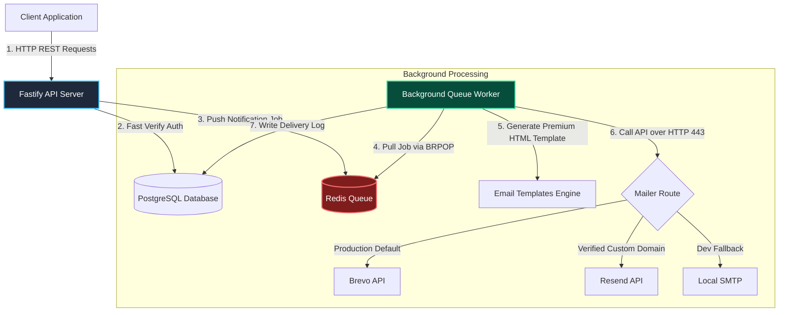

# ⚡ NotiFlow — Authentication & Notification Engine

> **Pitch Deck & System Architecture Guide**  
> *Prepared for: Developers, Client Teams, and Business Stakeholders*

---

## 📌 Executive Summary

Every modern web application requires two foundational pillars before it can launch: **Secure User Access (Authentication)** and **Reliable User Communication (Notifications)**. Building these from scratch for every new project wastes time, introduces security risks, and delays time-to-market.

**NotiFlow** is a production-grade, high-performance, and secure backend REST API engine that solves this problem once and for all. It serves as an independent, plug-and-play gateway that manages secure user sessions and handles asynchronous, high-volume notification delivery (Email, Webhooks, and Push) without slowing down the primary application.

Built from scratch using **Node.js** and **Fastify**, NotiFlow is optimized for ultra-low latency and maximum throughput.

---

## 🎯 The Business Pitch: Why NotiFlow?

### 1. Built for Speed and Low Infrastructure Costs
Most Node.js applications use Express, which has significant overhead. NotiFlow is powered by **Fastify**, a framework capable of handling up to **2-3x more requests per second** than Express. This means you can run your application on cheaper, smaller server instances (like Render or AWS free tiers) while serving more concurrent users.

### 2. Bulletproof Session Security (Active Review Phase)
We don't cut corners on security. NotiFlow is in its early development phase, and the current **Double-Token JWT Authentication** is under active architectural review to ensure a seamless developer integration:
* **Access Tokens** (15-minute lifespan) are kept in memory to authorize actions.
* **Refresh Tokens** (7-day lifespan) are stored in secure, **HttpOnly, SameSite cookies**.
* This approach provides bank-grade security, protecting user accounts against **XSS (Cross-Site Scripting)** and **CSRF (Cross-Site Request Forgery)** attacks.

### 3. Non-Blocking Email Pipeline (Redis Queue)
Email delivery APIs (like SendGrid or Mailgun) can take 1 to 3 seconds to respond. If a user registers and the server waits for the email API before responding, the user experiences a lag.
* NotiFlow uses an **Asynchronous Redis Queue**.
* When a user triggers an email, the API server instantly replies (`202 Accepted`) and pushes the job to a background worker.
* The user experiences **zero delay**, while the background worker handles the delivery in the background.

### 4. Zero SMTP Port Blockage Bottleneck (The Render-Ready Mailer)
Cloud platforms like **Render**, **Heroku**, and **DigitalOcean** block standard SMTP ports (25, 465, 587) to prevent spam, which breaks traditional libraries like Nodemailer.
* NotiFlow includes a custom **Dynamic Hybrid Mailer**.
* In production, it routes emails via secure HTTP REST APIs (port 443) using **Brevo** or **Resend**.
* In local development, it automatically falls back to traditional SMTP.
* **Business Benefit:** You can deploy to free or low-cost cloud tiers instantly without dealing with blocked email ports.

### 5. Premium Brand Communication out of the Box
No more boring, plain-text automated emails. NotiFlow comes pre-integrated with **premium dark email templates** (Vercel/Linear style). With sleek typography, clean layouts, and glowing top accents, your users receive high-quality communications from day one.

---

## ⚙️ How It Works: System Architecture

The following diagram illustrates how a client application (e.g., React, Vue, iOS/Android App) interacts with NotiFlow and how tasks are processed asynchronously:

---

## 🛠️ The Tech Stack (Under the Hood)

We chose each technology in NotiFlow to maximize execution speed, code clarity, and ease of deployment:

| Technology | Role | Why We Selected It |
|---|---|---|
| **Node.js + Fastify** | Web Server | Lightweight, ultra-fast routing, native JSON Schema validation. |
| **PostgreSQL (Neon)** | Database | Relational integrity, serverless auto-scaling, structured storage for users/logs. |
| **Redis (Upstash/ioredis)** | Queue & Cache | High-speed, in-memory data store for decoupling email tasks. |
| **JWT & BCrypt** | Security | Modern session standard paired with slow, secure password hashing. |
| **Brevo / Resend APIs** | Email Delivery | Reliable delivery over HTTP/HTTPS, bypassing restricted cloud ports. |
| **Swagger / OpenAPI** | Documentation | Auto-generates clean, interactive documentation at `/docs` for frontend teams. |

---

## 🔌 API Integration Quick-Guide

For frontend engineers or partner teams integrating with NotiFlow, here is a summary of the core endpoints. All request and response bodies are standardized in JSON format.

### 🔑 Authentication Routes (`/api/auth`)

| Action | HTTP Method | Endpoint | Authorization | Description |
|---|---|---|---|---|
| **Register** | `POST` | `/register` | Public | Creates a new user profile. |
| **Login** | `POST` | `/login` | Public | Verifies credentials; returns `accessToken` (JSON) and sets `refreshToken` (HttpOnly Cookie). |
| **Refresh Session** | `POST` | `/refresh` | Cookie | Reads refresh cookie and generates a new, short-lived access token. |
| **Change Password** | `POST` | `/change-password` | Bearer Token | Updates password securely after verifying current password. |
| **Logout** | `POST` | `/logout` | Bearer Token | Invalidates session and clears the cookie. |

### 🔔 Notification Routes (`/api/notifications`)

| Action | HTTP Method | Endpoint | Authorization | Description |
|---|---|---|---|---|
| **Queue Notification** | `POST` | `/send` | Bearer Token | Queues an email notification (`WELCOME`, `PASSWORD_CHANGE`, etc.) for a specific user. |
| **Get Notifications** | `GET` | `/` | Bearer Token | Retrieves a list of past notifications sent to the authenticated user. |

---

## 📈 Future Roadmap & AI Integration

NotiFlow is built to be modular and future-proof. In upcoming updates, we plan to significantly expand the platform by leveraging advanced AI technologies and scaling its core services:

### 1. 🤖 AI-Driven Enhancements (Core Growth Engine)
We leverage free and open-source AI tools, LLM APIs, and AI coding assistants to quickly design, test, build, and deploy new features:
* **AI-Generated Smart Copywriting:** Integrate free LLM APIs to automatically write, optimize, or tailor email/notification subject lines and body copy based on user behavior and context.
* **Smart Notification Routing:** Use light AI models to analyze when users are most active and queue/schedule notifications to be delivered at the optimal time to maximize open rates.
* **AI-Powered Code Co-pilots & Agents:** As a modern developer, I leverage free, state-of-the-art AI coding assistants (like Google Gemini, VS Code extensions) to review code, auto-generate unit tests, audit security, and rapidly implement advanced features. This ensures that we maintain enterprise-grade code standards and build at 10x speed with a lean team.

### 2. 📲 Multi-Channel Alert Delivery
* **SMS & WhatsApp Alerts:** Integrate services like Twilio or free messaging APIs into the background worker queue.
* **In-App Push Notifications:** Support WebSocket connections or Firebase Cloud Messaging (FCM) to deliver alerts directly inside browser/mobile screens.

### 3. 🛡️ Enterprise & Platform Scaling
* **Webhooks Publisher:** Allow external systems to register endpoints to receive real-time event notifications.
* **Multi-Tenant Routing:** Allow a single NotiFlow server to support multiple client applications with isolated API-keys, transforming NotiFlow into a SaaS (Software-as-a-Service) model.

### 4. 🔑 Passwordless Redis OTP Auth Flow
As part of our active authentication review, we are planning an alternative passwordless login mechanism:
* **Redis-Backed Verification:** Temporary OTPs will be stored directly in Redis with a short **1-minute Time-To-Live (TTL)**.
* **Zero-Maintenance Overhead:** By offloading OTP storage to Redis with auto-expiry, we eliminate the need for persistent DB storage, database write-locks, or background cleanup cron jobs. This keeps our PostgreSQL database clean and maintenance-free.

---

## 👨‍💻 Developer & Team Handoff

* To run the application locally, read the setup guide in the main [README.md](file:///D:/SwitchJob/notiflow/Readme.md).
* Use the interactive documentation at `http://localhost:3000/docs` to test live endpoints using Swagger UI.
* Environment configurations can be modified inside the [dotenv file](file:///D:/SwitchJob/notiflow/.env).
